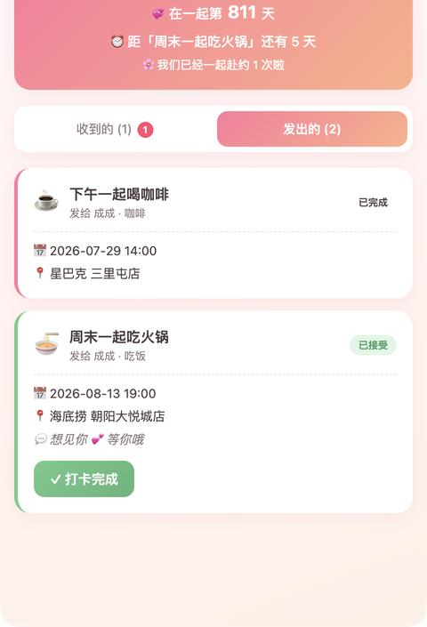
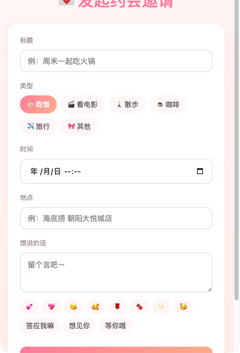
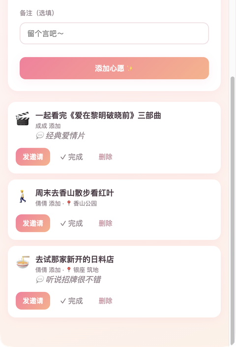
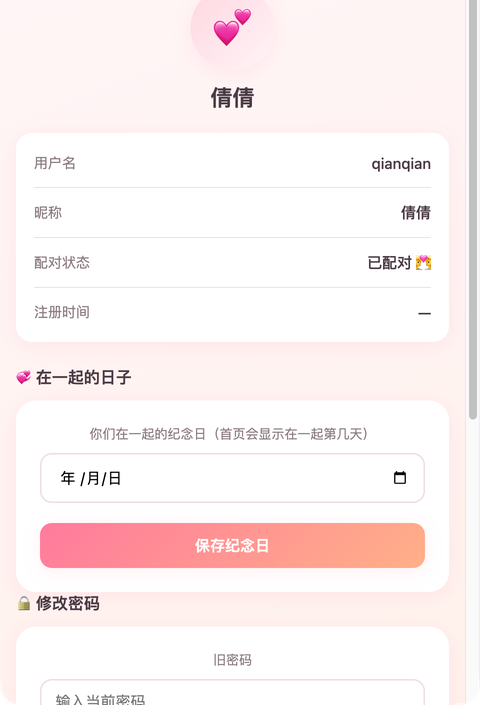

# 💕 约会 · 两个人的小天地

> 一个情侣约会邀请 Web App：男女朋友配对后，可以互相发送约会邀请、维护心愿单、记录在一起的每一天。

在线 Demo：**https://haoyidechengzi.xyz** （已部署，绑定自有域名 + HTTPS，国内可直接访问）

## 📷 功能截图

<p align="center">
  
  
  
  
</p>

> 左起：首页（纪念日倒计时 + 赴约统计 + 待回复红点）/ 发起邀请（表情贴纸）/ 心愿单 / 个人中心

---

## ✨ 功能特性

| 模块 | 说明 |
|---|---|
| 👫 情侣配对 | 一方生成 6 位配对码，另一方输入码完成绑定，一对一关系 |
| 💌 约会邀请 | 发起邀请（标题/类型/时间/地点/留言），对方可接受 / 婉拒 / 取消 |
| ✓ 完成打卡 | 已接受的约会可标记"完成"，首页统计累计赴约次数 |
| 📝 约会心愿单 | 把想一起做的事记下来，发邀请时一键选用，自动带出标题/类型/地点 |
| 💞 纪念日倒计时 | 设置"在一起的日子"，首页实时显示「在一起第 N 天」+ 距下次约会倒计时 |
| 🔔 状态提醒 | 收到待回复邀请时，Tab 上显示数字红点 |
| 😘 表情贴纸 | 邀请留言支持一键插入可爱表情 |
| 👤 个人中心 | 查看账号信息、修改密码、设置纪念日 |
| 🔐 记住登录 | 登录页可勾选"记住账号密码"，下次自动填入 |

---

## 🛠 技术栈

**前端**
- React 18 + Vite 5（构建）
- React Router 6（路由）
- 原生 fetch + JWT（鉴权），localStorage 持久化登录态

**后端**
- Node.js + Express 4（RESTful API）
- PostgreSQL（pg 驱动，连接池）
- bcryptjs（密码哈希）+ jsonwebtoken（JWT 签发/校验）

**部署**
- Vercel Serverless Functions（`api/index.js` 作为统一入口，`vercel.json` 把 `/api/*` 重写到该函数）
- Supabase PostgreSQL（东京节点，pooler 连接）
- 自有域名 `haoyidechengzi.xyz` + Vercel 自动 HTTPS

---

## 📐 架构与设计要点

### 前后端分离 + Serverless 统一入口
- 前端打包成静态资源由 Vercel CDN 托管
- 所有 `/api/*` 请求通过 `vercel.json` 的 rewrite 规则统一进入 `api/index.js`，再交给同一个 Express app 处理
- **一套 Express 代码同时服务本地开发与 Serverless**：本地 `server/index.js` 直接 `app.listen`，线上 `api/index.js` 把 `(req, res)` 转发给同一个 `app`

### 数据库幂等迁移
- `server/db.js` 启动时执行建表 SQL，全部使用 `CREATE TABLE IF NOT EXISTS` + `ALTER TABLE ... ADD COLUMN IF NOT EXISTS`，保证增量字段（如 `anniversary`）在已部署的库上安全升级

### 鉴权
- 登录/注册成功签发 7 天有效期的 JWT，前端存 localStorage
- `authRequired` 中间件解析 token 并回查数据库，确保用户真实存在且信息最新

### 时区处理
- 纪念日字段为 `DATE` 类型，用 `to_char(anniversary, 'YYYY-MM-DD')` 在 SQL 层格式化返回，避免 pg 驱动返回 UTC 时间戳导致的前端日期偏移一天

### 数据模型

```
users        id, username(唯一), password_hash, nickname, couple_id, created_at
couples      id, pair_code(唯一), anniversary, created_at
invitations  id, couple_id, from_user_id, to_user_id, title, type,
             meet_time, location, note, status, created_at, responded_at
wishlists    id, couple_id, user_id, title, type, location, note, done, created_at
```

`invitations.status`：`pending` → `accepted`/`rejected`/`cancelled` → `completed`

---

## 📂 目录结构

```
date-app/
├── api/
│   └── index.js            # Vercel Serverless 入口，转发请求给 Express
├── server/
│   ├── app.js              # 纯 Express app（本地 + Serverless 共用）
│   ├── index.js            # 本地开发入口（启动 HTTP 服务 + 建表）
│   ├── db.js               # pg 连接池 + 幂等建表
│   ├── auth.js             # JWT 签发 + authRequired 中间件
│   └── routes/
│       ├── auth.js         # 注册/登录/me/改密码
│       ├── couples.js      # 配对/另一半/纪念日
│       ├── invitations.js  # 邀请 CRUD + 接受/取消/完成
│       └── wishlists.js    # 心愿单 CRUD
├── src/
│   ├── App.jsx             # 路由 + 顶栏布局
│   ├── api.js              # 前端请求封装
│   ├── context/AuthContext.jsx  # 登录态 Context
│   ├── pages/              # Login/Register/Pairing/Home/NewInvitation/Wishlist/Profile
│   └── styles.css
├── vercel.json             # /api/* rewrite + 构建配置
└── package.json
```

---

## 🚀 本地运行

```bash
# 1. 安装依赖
npm install

# 2. 配置环境变量
cp .env.example .env
# 编辑 .env，填入你的 DATABASE_URL 和 JWT_SECRET

# 3. 启动（同时起前端 5173 + 后端 3001）
npm run dev
```

浏览器打开 http://localhost:5173

> 本地若无 PostgreSQL，可用 `docker compose up -d` 起一个（见 `docker-compose.yml`）。

---

## 📡 API 概览

| 方法 | 路径 | 说明 |
|---|---|---|
| POST | `/api/auth/register` | 注册 |
| POST | `/api/auth/login` | 登录 |
| GET  | `/api/auth/me` | 当前用户信息 |
| POST | `/api/auth/change-password` | 修改密码 |
| POST | `/api/couples/code` | 生成配对码 |
| POST | `/api/couples/pair` | 用配对码绑定 |
| GET  | `/api/couples/partner` | 获取另一半 |
| GET/POST | `/api/couples/anniversary` | 读取/设置纪念日 |
| GET  | `/api/invitations` | 邀请列表 + 完成统计 |
| POST | `/api/invitations` | 创建邀请 |
| POST | `/api/invitations/:id/respond` | 接受/婉拒 |
| POST | `/api/invitations/:id/cancel` | 取消邀请 |
| POST | `/api/invitations/:id/complete` | 完成打卡 |
| GET  | `/api/wishlists` | 心愿单列表 |
| POST | `/api/wishlists` | 添加心愿 |
| DELETE | `/api/wishlists/:id` | 删除心愿 |
| POST | `/api/wishlists/:id/toggle` | 切换完成状态 |

所有需登录的接口通过 `Authorization: Bearer <token>` 携带 JWT。

---

## 📝 体验流程

1. 注册两个账号（A 和 B，可开两个浏览器窗口）
2. A 在「配对」页生成 6 位配对码，告诉 B
3. B 在「配对」页输入码 → 绑定成功
4. A 在「发起邀请」发送约会邀请
5. B 在「收到的」列表接受 → 双方都能点「完成打卡」
6. 在「我的」页设置在一起的纪念日，首页实时显示在一起第几天

---

## 📄 License

MIT
